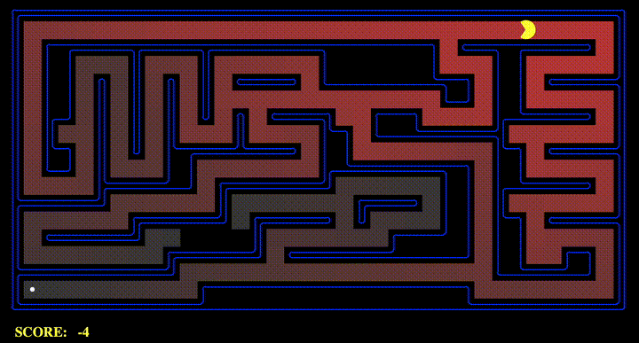

# Maze Navigator

**Description**: Maze Navigator explores different pathfinding algorithms, allowing Pac-Man to navigate a maze efficiently. Implemented algorithms include Depth-First Search, Breadth-First Search, Uniform Cost Search, and A* Search. Pac-Man will not only find routes to a specified location but will also plan the most efficient way to collect food.

Here's a short demo of the Pac-Man in action:



## Features:
- Implements DFS, BFS, UCS, and A*.
- Includes an autograder to test the accuracy of implemented algorithms.
- Optimizes routes using heuristics.

## Files:
- `search.py` - Contains search algorithms.
- `searchAgents.py` - Defines agents that use the search algorithms.

## Usage:
To test algorithms, run commands from `commands.txt` like:
```
bash
python pacman.py -l tinyMaze -p SearchAgent -a fn=dfs
```

## Requirements:

- Python 3.x
- Autograder provided for testing

## Getting Help

Refer to `autograder.py` for additional support.
