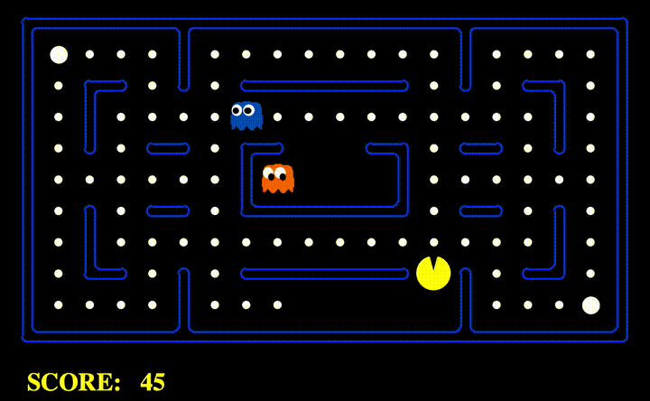

# Pac-Man Decision Maker

**Description**: This project expands on single-agent search to include decision-making against adversarial agents (ghosts). Key techniques implemented include Minimax, Alpha-Beta Pruning, and Expectimax, with a custom evaluation function to guide Pac-Man's choices.

Here's a short demo of the Pac-Man in action:



## Features:

- Minimax and Alpha-Beta Pruning for efficient decision-making.
- Expectimax for scenarios with probabilistic opponents.
- Customizable evaluation functions to test different strategies.

## Files:

- `multiAgents.py` - Main file for multi-agent search algorithms.

## Usage:

To test a particular agent, use commands from `commands.txt` such as: 
```
python pacman.py -p MinimaxAgent -l smallClassic
```

## Requirements:

- Python 3.x
- Basic understanding of multi-agent search strategies.

## Getting Help

Use `autograder.py` to verify implementations and refer to relevant AI resources for deeper understanding.