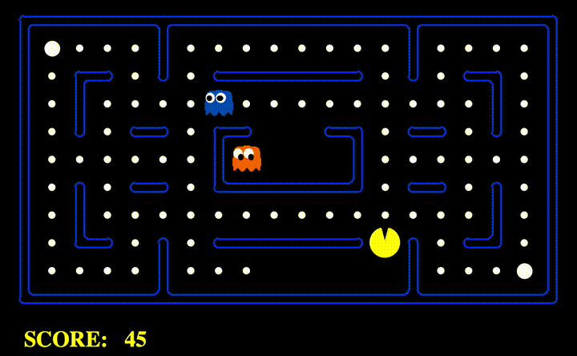

# Pac-Man AI Suite

**Description**: The "Pac-Man AI Suite" brings together three key AI projects designed around the classic Pac-Man game. The suite incorporates a variety of AI techniques, including search algorithms, multi-agent decision-making, and reinforcement learning, to develop intelligent agents that navigate complex mazes, interact with opponents, and learn from rewards.

Here's a short demo of the Pac-Man in action:

## Sub-Projects:
1. **Maze Navigator** - Implements pathfinding techniques.
2. **Pac-Man Decision Maker** - Develops decision-making strategies in competitive environments.
3. **Reward-Based Pac-Man** - Applies reinforcement learning for reward optimization.

## Getting Started:
Each project comes with Python files and an autograder. To begin:
1. Set up Python environment with dependencies.
2. Use `python autograder.py` to test individual components.
3. Follow each sub-project's README for detailed instructions.

## Requirements:
- Python 3.x and necessary libraries (see specific sub-project requirements).