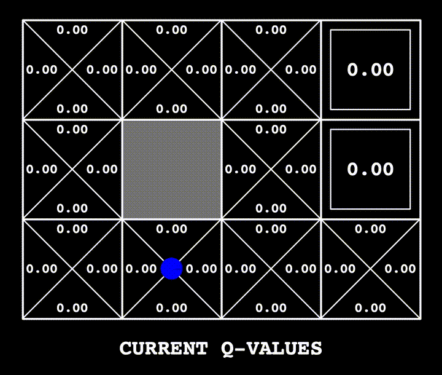

# Reward-Based Pac-Man

**Description**: This project dives into reinforcement learning through a series of exercises where Pacman learns to maximize rewards by navigating through a grid and avoiding negative outcomes. Techniques include Value Iteration, Q-learning, and Approximate Q-learning.

Here's a short demo of the Pac-Man in action:



## Features:

- Value Iteration for policy generation.
- Q-learning and Epsilon Greedy for trial-and-error-based learning.
- Approximate Q-learning with feature extraction for enhanced learning efficiency.

## Files:

- `valueIterationAgents.py` - Value Iteration agent.
- `qlearningAgents.py` - Q-learning and Approximate Q-learning agents.

## Usage:

To test algorithms, run commands from `commands.txt` like:
```
python gridworld.py -a q -k 50
```

## Requirements:

- Python 3.x
- Familiarity with MDPs and reinforcement learning concepts.

## Getting Help

For troubleshooting, use `autograder.py` and consult reinforcement learning resources as needed.